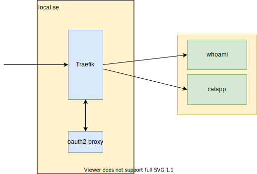

# Traefik and oauth2-proxy

This is an example project for setting upp Traefik with oauth2-proxy for simple authentication and authorization

- With one oauth2-proxy callback for all subdomains.
- With a [hack](https://github.com/oauth2-proxy/oauth2-proxy/issues/1297) that enables one callback url only, see [sign in template](oauth_templates/sign_in.html)
- With customized login page, see [docker-compose.yml](docker-compose.yml)
- With additional security headers



Run with `docker compose up`, then

- <https://traefik.local.se> show the dashboard, does not require login
- <https://whoami.local.se> shows the whoami service requiring login
- <https://catapp.local.se> shows the catapp service requiring login
- <https://catapp.local.se/oauth2/sign_out> provides SLO (works for any subdomain)

## Prerequisite: local.se

In order to provide a developer experience as close to deployment environment as possible, we use local.se instead of localhost.
This enables sharing cookies for all services, enabling local SSO and SLO.
To make this work, you need to add all subdomains to your static DNS lookup file.
On linux/Mac it is `/etc/hosts`, add this line to the file:

```bash
127.0.0.1 local.se traefik.local.se whoami.local.se catapp.local.se
```

## Prerequisite: Google auth

Currently the project supports Google OIDC, see <https://oauth2-proxy.github.io/oauth2-proxy/docs/configuration/oauth_provider#google-auth-provider> for instructions on how to set it up.

When setting up your credentials, make sure you add <https://oauth.local.se/oauth2/callback> to Authorized redirect URIs

Then you can either set the environment variables yourself, or create a .env file with the contents

```bash
GOOGLE_CLIENT_ID=<your google id>
GOOGLE_CLIENT_SECRET=<your google secret>
```

## OAUTH2-proxy

### How it works

1. The service url is envoked, e.g. <https://traefik.local.se>
2. Traefik asks the forwardAuth middleware, e.g. https://oauth.local.se/oauth2/auth, which responds with 200 for authenticated and 401 for unauthenticated, depending on the _oauth2_proxy cookie
3. For 401, the errors middleware is invoked, which queries `/oauth2/sign_in`, showing a html page with a button. This button posts to `/oauth2/start?rd=/`, which starts the OIDC flow.  
4. The callback from Google OIDC is https://oauth.local.se/oauth2/callback, which sets the _oauth2_proxy cookie and redirects to what the rd-parameter to /oauth2/start?rd=xxx was, as long as it is to a subdomain of local.se, as set by OAUTH2_PROXY_WHITELIST_DOMAINS, to prevent malicious forward attempts.

We use cookie domain .local.se with samesite="", meaning all subdomains gets the cookie - SSO.

Applications can get information about the user from

- X-Auth-Request-Email, X-Auth-Request-User
- GET /oauth2/userinfo, which returns json with id and email.

There are several extra endpoints like, /oauth2/sign_out which can be found at [endpoints](https://oauth2-proxy.github.io/oauth2-proxy/docs/features/endpoints)

### Ouath2-proxy links

- [Oauth2-proxy docs](https://oauth2-proxy.github.io/oauth2-proxy/docs/)
- [Oauth2-proxy docker binaries](https://quay.io/repository/oauth2-proxy/oauth2-proxy?tab=tags&tag=latest)
- [Oauth2-proxy source](https://github.com/oauth2-proxy/oauth2-proxy)

## TLS

In order to get A-rating on SSLabs, you need to disable TLS 1.0 and 1.1.
As noted [here](https://github.com/traefik/traefik/issues/5507) it can only be done in the dynamic configuration file using the file provider.

Test with:

```bash
openssl s_client -connect traefik.local.se:443 -tls1
# Should fail with something like: ...error... tlsv1 alert protocol version ...
openssl s_client -connect traefik.local.se:443 -tls1_2 | grep CONNECTED
# Should succeed with CONNECTED
```
